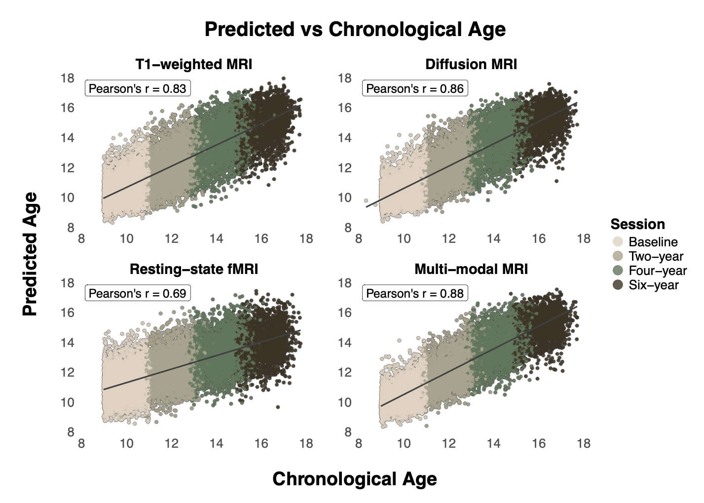

# brain-age-prediction-4wave
Brain age prediction code for training and testing using the ABCD Study release 6.0 data (four waves)

## Background

This repo contains two scripts:

| Script | Description |
|--------|-------------|
| **training_validation_ABCD6.0.R** | Trains an XGBoost model to predict brain age from imaging features using 5-fold cross-validation with 2 repeats and a 400-point Latin hypercube hyperparameter grid |
| **predict_test_set_ABCD6.0.R**  | Applies the trained model to the held-out test sample and performs age-bias correction |

These scripts are used for brain age testing and training used in \
Beck et al. (https://www.medrxiv.org/content/10.64898/2025.12.31.25343265v2)

## Model

Brain age is predicted using gradient boosted regression trees (XGBoost) with the following key design choices:

- Target variable: chronological age at scan
- Predictors: imaging-derived features (modality-specific; see below)
- Sex excluded from predictors so the model captures age-related brain variation independent of sex
- Hyperparameter tuning: 7 parameters jointly tuned (number of trees, tree depth, minimum node size, loss reduction, subsample proportion, column subsample, learning rate) using a 400-point Latin hypercube grid evaluated via 5-fold cross-validation × 2 repeats, stratified by age
- Model selection: parsimonious parameter set selected using the one-standard-error rule on mean absolute error
- Preprocessing: near-zero-variance removal and normalisation applied within each cross-validation fold to prevent data leakage

## Data preparation

- Data are split 50:50 into a training/validation sample (Sample 1) and a held-out test sample (Sample 2) prior to running these scripts. The split is:
- Family-aware: siblings are kept within the same partition using a group shuffle split with family ID as the grouping variable, ensuring no family members are split across training and test sets
Participant-aware: all imaging waves from the same participant remain in the same partition, preventing identity confounding across the four longitudinal waves
Balanced: age distribution, sex ratio, and proportion of longitudinal versus cross-sectional observations are matched across partitions
- Imaging data are harmonised across scanners using LongComBat prior to model training, applied at the scanner level to account for sites operating multiple scanner models or undergoing scanner upgrades across the four waves. The overall train/validation/test split is therefore 40/10/50 percent of the full sample.

## Instructions

### 1. Training
Rscript training_validation_ABCD6.0.R

Sample1.Rda is loaded as the training sample. An internal 80:20 split produces a training set and a validation set used for age-bias correction.

### 2. Test / predict
Rscript predict_test_set_ABCD6.0.R

Sample2.Rda is loaded as the held-out test set. Predictions are generated and age-bias correction is applied using the validation set following the procedure described in de Lange & Cole (https://doi.org/10.1016/j.nicl.2020.102229).

## Notes

The scripts above use T1-weighted imaging data but scripts are also available for dMRI, rs-fMRI, and a multi-modal model. The figure below shows performance of each model using the code in this repository.

### Contact
For questions about the code or to discuss collaboration, please contact [dani.beck@psykologi.uio.no](mailto:dani.beck@psykologi.uio)

